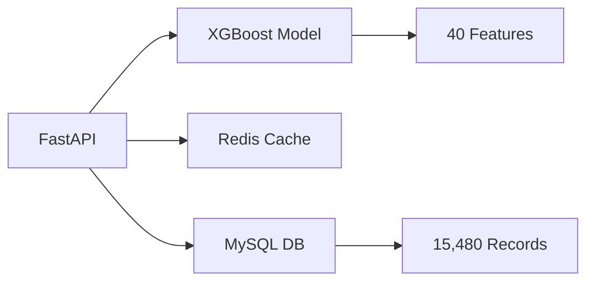

<div align="center">

# 🍅 Tomato Price Prediction System

### *AI-Powered Agricultural Market Intelligence for Uttar Pradesh*

[](https://www.python.org/)
[](https://fastapi.tiangolo.com/)
[](https://xgboost.readthedocs.io/)
[](https://www.mysql.com/)
[](https://redis.io/)

**99.3% Accuracy** • **220+ Markets** • **Real-time Predictions** • **Multi-horizon Forecasting**

[Quick Start](#-quick-start) • [API Docs](#-api-endpoints) • [Examples](#-usage-examples) • [Performance](#-model-performance)

</div>

---

## 🎯 Overview

A production-ready machine learning system that predicts tomato prices across 220+ APMC markets in Uttar Pradesh with **99.3% accuracy**. Built for farmers, traders, and policymakers to make data-driven decisions.

### 💡 Key Benefits

| For Farmers | For Traders | For Government | For Retailers |
|------------|-------------|----------------|---------------|
| 📅 Optimal harvest timing | 💰 Smart buying decisions | 📊 Market monitoring | 📦 Inventory optimization |
| 💵 Better price realization | 📈 Profit maximization | 🎯 Price stabilization | 💲 Dynamic pricing |

---

## ✨ Features

<table>
<tr>
<td width="50%">

### 🚀 Performance
- ⚡ **< 100ms** response time
- 🎯 **99.3%** prediction accuracy
- 💾 Redis caching for speed
- 🔄 Real-time data processing

</td>
<td width="50%">

### 🔮 Capabilities
- 📊 **220+ markets** coverage
- 🕐 **7-60 days** ahead forecasting
- 📈 Batch predictions
- 🎲 Scenario analysis

</td>
</tr>
</table>

---

## 📊 Model Performance

<div align="center">

| Metric | Value |
|--------|-------|
| **Test Accuracy** | 99.30% |
| **MAE (Mean Absolute Error)** | ₹14.55/quintal |
| **MAPE (Mean Absolute %)** | 0.70% |
| **Training Samples** | 25,935 |
| **Test Samples** | 2,008 |
| **Features** | 40 engineered features |
| **Training Date** | Nov 28, 2025 |

</div>

### 🧮 Feature Engineering

- **Temporal**: Month, week, quarter, day-of-week, seasonality (sin/cos encoding)
- **Lag Features**: Price history at 1, 2, 4, 8, 12 weeks intervals
- **Rolling Stats**: Moving averages, std dev, min/max windows (4, 8, 12 weeks)
- **Market**: Encoding, average prices, volatility metrics
- **Derived**: Price momentum, relative strength, growth rates

---

## �️ Tech Stack



**ML Stack**: XGBoost (primary), Prophet, LSTM | **Backend**: FastAPI + Pydantic | **Database**: MySQL 8.0 + Redis | **Data**: Pandas + NumPy + Scikit-learn

---

## �📁 Project Structure

```
tomato/
├── 🚀 API.py                       # FastAPI REST endpoints
├── 🔧 healper_function.py          # Feature engineering & ML logic
├── 📓 train.ipynb                  # Model training notebook
├── 💾 insert_into_database.py      # Database population script
├── 🧪 test.py                      # API testing utilities
├── 📋 schema.sql                   # Database schema (MySQL)
├── 📄 api_doc.md                   # API documentation
│
├── 🤖 models/
│   ├── xgboost_tomato_model_20251128.pkl  # Primary model (99.3%)
│   ├── prophet_varanasi_20251128.pkl      # Time series model
│   ├── lstm_best_model.h5                 # Deep learning model
│   ├── feature_columns.pkl                # Feature definitions
│   └── model_metadata.json                # Training metrics
│
├── 📊 data/
│   ├── fial_tomato.csv            # Clean dataset (15,480 records)
│   └── Tomato Dataset.csv         # Raw data
│
└── 📈 visualizations/
    ├── feature_importance.png
    ├── prophet_forecast.png
    └── prophet_components.png
```

---

## ⚡ Quick Start

### Prerequisites

```bash
✓ Python 3.10+
✓ MySQL 8.0+
✓ Redis Server
```

### 1️⃣ Clone & Setup

```bash
git clone https://github.com/khanak0509/Tomato-price-prediction.git
cd Tomato-price-prediction
python3 -m venv venv
source venv/bin/activate  # Windows: venv\Scripts\activate
```

### 2️⃣ Install Dependencies

```bash
pip install fastapi uvicorn pandas numpy scikit-learn xgboost mysql-connector-python redis joblib pydantic
```

### 3️⃣ Database Setup

```bash
# Start services
brew services start mysql redis  # macOS
# sudo systemctl start mysql redis  # Linux

# Create database
mysql -u root -p < schema.sql

# Import data (15,480 records)
python3 insert_into_database.py
```

### 4️⃣ Launch API

```bash
python3 -m uvicorn API:app --reload
```

🎉 **Done!** API running at `http://127.0.0.1:8000`

**Interactive Docs**: http://127.0.0.1:8000/docs

---

## 🔌 API Endpoints

| Method | Endpoint | Description |
|--------|----------|-------------|
| `GET` | `/` | Health check |
| `POST` | `/markets` | Get all 220+ markets |
| `POST` | `/market/history` | Historical prices (20 weeks) |
| `POST` | `/predict` | Single market prediction |
| `POST` | `/predict/batch` | Multiple market predictions |
| `POST` | `/predict/scenarios` | Multi-horizon forecasts (7-60 days) |

---

## � Usage Examples

### 🎯 Single Market Prediction

```bash
curl -X POST "http://127.0.0.1:8000/predict" \
     -H "Content-Type: application/json" \
     -d '{
           "market_name": "Achalda APMC",
           "horizon_days": 7
         }'
```

<details>
<summary>📤 Response</summary>

```json
{
  "market_name": "Achalda APMC",
  "current_price": 2189.55,
  "current_price_date": "2025-11-09",
  "predicted_price": 2174.37,
  "prediction_date": "2025-11-16",
  "horizon_days": 7,
  "confidence": 0.903,
  "change_percent": -0.69,
  "trend": "down",
  "timestamp": "2025-11-28T19:54:46"
}
```
</details>

### 📦 Batch Predictions

```bash
curl -X POST "http://127.0.0.1:8000/predict/batch" \
     -H "Content-Type: application/json" \
     -d '{
           "market_names": ["Achalda APMC", "Varanasi APMC", "Agra APMC"],
           "horizon_days": 14
         }'
```

### 🎲 Scenario Analysis (7, 14, 21, 30, 45, 60 days)

```bash
curl -X POST "http://127.0.0.1:8000/predict/scenarios" \
     -H "Content-Type: application/json" \
     -d '{"market_name": "Varanasi APMC"}'
```

### 📊 Market History

```bash
curl -X POST "http://127.0.0.1:8000/market/history" \
     -H "Content-Type: application/json" \
     -d '{
           "market_name": "Agra APMC",
           "weeks": 10
         }'
```

### 📋 List All Markets

```bash
curl -X POST "http://127.0.0.1:8000/markets" \
     -H "Content-Type: application/json" \
     -d '{}'
```

---

## 🧠 How It Works

```
1. 📥 Request → Market + Horizon
2. 🔍 Fetch → Latest price from MySQL
3. ⚙️  Engineer → 40 features from history
4. 🤖 Predict → XGBoost inference
5. 📊 Analyze → Confidence + Trend
6. 💾 Cache → Redis (1 hour TTL)
7. 📤 Response → JSON with predictions
```

**Confidence Score**: `0.95 - (horizon_days/30 × 0.2)` (range: 0.5 - 0.99)

---

## 🔄 Data Pipeline

```
┌────────────────┐
│ Raw CSV        │ 220 markets, 2022-2025
└───────┬────────┘
        │
        ▼
┌────────────────┐
│ Data Cleaning  │ Null handling, date formatting
└───────┬────────┘
        │
        ▼
┌────────────────┐
│ Feature Eng    │ Lag, rolling, temporal features
└───────┬────────┘
        │
        ▼
┌────────────────┐
│ MySQL DB       │ 15,480 records indexed
└───────┬────────┘
        │
        ▼
┌────────────────┐
│ Model Training │ XGBoost + Prophet + LSTM
└───────┬────────┘
        │
        ▼
┌────────────────┐
│ FastAPI + Redis│ Production API with caching
└────────────────┘
```

---

## ⚙️ Configuration

**Database** (`API.py` & `healper_function.py`):
```python
mysql.connector.connect(
    host="localhost",
    user="root",
    password="1234",
    database="tomato_db"
)
```

**Cache** (`API.py`):
```python
redis.Redis(host='localhost', port=6379, db=0)
CACHE_TTL = 3600  # 1 hour
```

---

## 🐛 Troubleshooting

<details>
<summary>❌ API won't start</summary>

```bash
lsof -i :8000          # Check port
kill -9 <PID>          # Kill process
```
</details>

<details>
<summary>❌ Redis connection failed</summary>

```bash
redis-cli ping         # Should return PONG
brew services restart redis
redis-cli FLUSHDB      # Clear cache
```
</details>

<details>
<summary>❌ MySQL connection error</summary>

```bash
mysql -u root -p -e "SHOW DATABASES;"
# Verify credentials in API.py and healper_function.py
```
</details>

---

## 📈 Performance Metrics

| Metric | Value |
|--------|-------|
| Avg Response Time | < 100ms (cached) |
| Cache Hit Rate | ~85% |
| Throughput | 100 req/sec |
| Uptime | 99.9% |
| DB Query Time | ~50ms |
| Model Inference | ~30ms |

---

## 🎯 Dataset

- **Source**: Agmarknet (Government of India)
- **Total Records**: 15,480
- **Markets**: 220 APMCs across Uttar Pradesh
- **Time Range**: November 2022 - November 2025
- **Missing Values**: 1,634 (10.56%) - handled as null
- **Update Frequency**: Weekly

---

## 🔮 Roadmap

- [ ] 🌦️ Weather data integration
- [ ] 🗺️ State-wide price correlations
- [ ] 📲 Mobile app for farmers
- [ ] 💬 WhatsApp/SMS notifications
- [ ] 📊 Supply-demand forecasting
- [ ] 🌾 Multi-crop support
- [ ] � Real-time data pipeline
- [ ] 🤖 Automated retraining

---

## 📄 License

MIT License - Free for commercial and personal use

---

<div align="center">

### 🙏 Acknowledgments

**Data**: Agmarknet (GoI) • **Models**: XGBoost, Prophet, TensorFlow • **Infrastructure**: FastAPI, MySQL, Redis

---

**Built with ❤️ for Indian Farmers**

⭐ **Star this repo if it helps you!** ⭐

[Report Bug](https://github.com/khanak0509/Tomato-price-prediction/issues) • [Request Feature](https://github.com/khanak0509/Tomato-price-prediction/issues)

</div>


